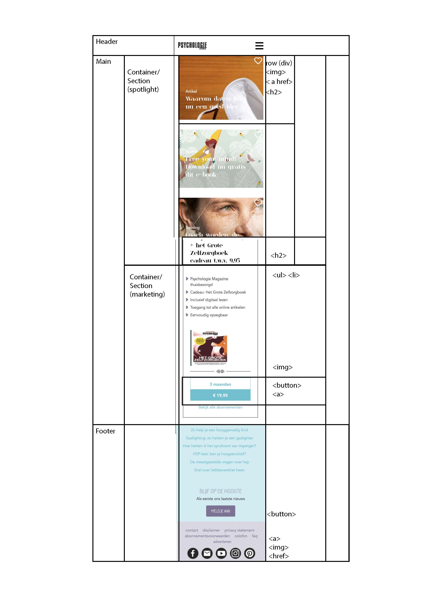
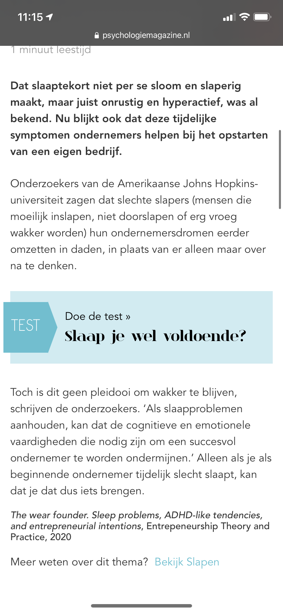

# Procesverslag
**Auteur:** Judith Koelewijn

Markdown cheat cheet: [Hulp bij het schrijven van Markdown](https://github.com/adam-p/markdown-here/wiki/Markdown-Cheatsheet). Nb. de standaardstructuur en de spartaanse opmaak zijn helemaal prima. Het gaat om de inhoud van je procesverslag. Besteedt de tijd voor pracht en praal aan je website.

## Bronnenlijst
1. https://travishorn.com/responsive-grid-in-2-minutes-with-css-grid-layout-4842a41420fe responsive grid and media queries 
2. https://css-tricks.com/snippets/svg/svg-hamburger-menu/
3. https://css-tricks.com/three-line-menu-navicon/

## Eindgesprek (week 7/8)

-dit ging goed & dit was lastig-

**Screenshot(s):**

## Voortgang 3 (week 6)

- CSS grid uitleg gehad, voorbeelden waren heel duidelijk, maar dit zelf toepassen ging nog stroef. 
- Code zat al zo vast in flexbox, en alleen goed op klein scherm dat ik opnieuw ben begonnen met schone code,
hierin een grid heb gemaakt die ik voor mij zag, en daarna de content toegevoegd. Dit werkte ideaal. 
Gaf precies wat ik nodig had, en daarna alle voordelen van grid ervaren. Uitleg media queries, dit was gelijk
duidelijk, had ik al wat mee gewerkt eerder dus ging goed. De media queries in combinatie met de grid werkte top,
website werd in no time responsive, en het programmeren werd hierdoor steeds makkelijker én leuker. 

In de vakantie laatste inhaalslag gemaakt. Toegankelijkheid gecheckt door door de hele website te tabben. 
Alles werkte, was goed gelinkt en dus toegankelijk zonder muis. Screenreader nog een keer getest, werkte alles zoals ik dacht?
Nog wat headings toegevoegd en aangepast. Daarna de HTML in een validatie check gedaan, errors eruit gehaald, code geoptimaliseerd
en CSS bekeken. Dubbele CSS code verwijderd, wat classes toegevoegd in mijn grid items om minder code te schrijven maar in eeen 
keer alles te kunnen aanroepen. 

- Beoordelingsformulier doorgenomen met code ernaast
- Readme nog een keer doorgenomen of deze up to date was, en alles opgeslagen :) 

## Voortgang 2 (week 5)

- Oplossing voor Javascript gevonden, toegepast en een werkende class gekregen.
- Nu uitwerken hoe ik dan ook daadwerkelijk iets doe met de class, nu is deze nog leeg, 
hoe krijg ik de navigatie zichtbaar? 
- Javascript voorbeelden bekeken, boek er weer even bijgepakt en wat mogelijke opties in basis taal uitgeschreven als klad. 

## Voortgang 1 (week 3)

### Stand van zaken

- hamburger menu lastig, nog niet aan toegekomen
- positioneren van tekst op een afbeelding of container met absolute ging goed
- Nog onderzoek doen naar hamburgermenu, hoe activeer ik dit in Javascript? 

**Screenshot(s):**

-screenshot(s) van hoe ver je bent met korte uitleg-

        
        
        
        

Grootste deel van de homepagina af (ongeveer 3/4e), het menu modet nog, en de footer.
De content in de main is af.

### Agenda voor meeting

-samen met je groepje opstellen-

| Daniel          | Judith             | Faye                   | Jelle              |
| ---             | ---                | ---                    | ---                |
| positionering   | navigatie          | aanpassingen website   | navigatie          |
| svg manipuleren | sections           | grid                   | section of article |
| flexbox         | verstoppen h1      | y-scaling              | juist gebruik cms  |

### Verslag van meeting

-na afloop snel uitkomsten vastleggen-

## Breakdownschets (week 1)

## Intake (week 1)
-uitwerken voor de kick-off werkgroep - begin van de eerste week-

**Je startniveau:** Startniveau is blauw

**Je focus:** - Focus is op de surface laag

**Je opdracht:** https://www.psychologiemagazine.nl https://www.psychologiemagazine.nl/artikel/slaaptekort-maakt-ondernemend/

**Screenshot(s) van de homepagina (small screen):**

**Screenshot(s) van de tweede pagina (artikel) (small screen):**

**Verslag screenreader gebruik, punten van aandacht:**

Verslag VoiceOver

- Linkjes misten om elementen (in eerdere versie wel latere code niet) nu wel toegevoegd 
- H1 Hidden goed toegepast , wordt voorgelezen, dit is fijn want anders zou je met een screenreader niet kunnen weten op wat voor webpage je zit. 
- Blog dit is waarom gezond perfectionisme niet bestaat, Lavendel. De alt tekst wordt voorgelezen, deze is misschien nietszeggend in deze situatie 
- Het tabben door de pagina heen gaat soepel, je komt bij elk linked item en kan vanaf hier alle artikelen kiezen, en er wordt voorgelezen waar het over gaat
- Ik heb voor ik ging testen mijn code gecheckt en aangepast dat er geen errors of missing headings zijn, en ik vind dat het goed te besturen is
- De button van het hamburgermenu werkt, je kan erheen tabben en hem openen. Alleen nog <a> toevoegen aan de list items zodat je hier ook doorheen kan tabben, maar ben nog bezig met de navigatie
- Laatste link heeft ook een alt tekst, deze is ook nietszeggend. 

 

